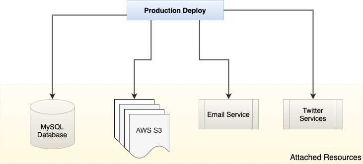

### IV.	Backing Services

The principle states that all the backing services, either local or third-party services, should be treated as attached resources. The principle or the application code makes no distinction between local and third-party services. To the application, all are attached resources, accessed via a URL or other locator/credentials stored in the config. The attached resources can be swapped at any point in time without impacting the service. 

Examples of the attached resources can be data-stores (such as Oracle, MongoDB, MySQL), messaging/queueing systems (such as ActiveMQ or RabbitMQ), SMTP services for outbound email (such as Postfix), and caching systems (such as Redis or Memcached).



For instance, the Spring JPA makes the code pretty agnostic to the actual database provider. Just defining the repository makes all standard operations avaliable - 

```sh
@Repository
public interface JoggingRepository extends JpaRepository<Jogger, Long> {
}
```