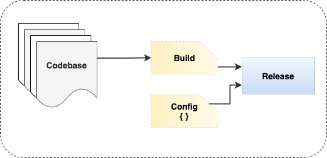

### V.	Build, Release, Run

The principle enforces a strict separation between the build, release, and run stages. For instance, any code changes are not possible at runtime as there is no way to propagate those changes back to the build stage. 

Automation using CI/CD tools (like Jenkins) facilitates the builds and deployment process. Further containerization tools (like Docker images) make it easy to separate the build, release, and run stages more efficiently.



#### Examples for each of the stages -

<strong>Build Stage</strong> - The build stage is a transform which converts a code repo into an executable bundle known as a build.
```sh
  $ mvn clean install
```
<strong>Release Stage</strong> - The release stage takes the build produced by the build stage and combines it with the deploy’s current config.

<strong>Run Stage</strong> - The run stage (also known as “runtime”) runs the app in the execution environment, by launching some set of the app’s processes against a selected release. For instance, docker container can be brought up using command below -
```sh
  $ docker run --name <container_id> -it <image_id>
```
