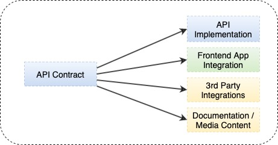

### XIII.	API First

API First principle implies defining the service contract first to help consumers understand what the request and response communication is expected to be. The service consumers can work in parallel to develop the consuming applications. All this can happen even before the actual service contract is implemented and is made available. 

A few of the major advantages of the API First approach are –
- Cross-Platform Compatible – Facilitates discussions with various stakeholders whether those are part of an internal team, customers, or third-party systems who want to integrate with the APIs
- Teams Can Develop in Parallel and Know What to Expect
- Enables Reuse of Schemas / Contract Definitions

The principle further helps in avoiding bottlenecks as a result of the Waterfall model as multiple stakeholders can work in parallel, finally cutting down the implementation and the integration time.

Further, it facilitates the virtualization of the APIs so that integrating systems can start running the tests against the mocks. This pattern is an extension of the contract-first development pattern, where developers concentrate on building the edges or seams of their application first.

There are numerous tools available to reap the benefits of the API-First Approach. For instance, Apiary provides things like GitHub integration and server mocks. Prism is another open-source HTTP mock server that can mimic your API’s behavior as if you already built it.




For instance, from Java perspective, Swagger can be utilized to genrate the API contracts which can be further vistualized using any of the tools (like Prism) for parallel development in consumer applications.

##### Sample spring - swagger dependencies -
```sh
dependencies {
    implementation group: 'io.springfox', name: 'springfox-swagger2', version: '3.0.0'
    implementation group: 'io.springfox', name: 'springfox-swagger-ui', version: '3.0.0'
}
```

##### Example - Usage of io.swagger.annotations.ApiResponse 
```sh
@PUT
@Path("/{contextName}/user/{userName}")
@Consumes({ "application/json" })
@Produces({ "application/json" })
@ApiOperation(value = "", notes = "", response = UserProperty.class, tags = {  })
@ApiResponses(value = {
        @ApiResponse(
                code = 200,
                message = "Successfully updated the user configuration",
                response = UserProperty.class),

        @ApiResponse(
                code = 404, message = "context or user not found", response = UserProperty.class),

        @ApiResponse(
                code = 500, message = "Server error", response = UserProperty.class) })
void updateUser(@ApiParam(value = "context name", required = true) @PathParam("contextName") String contextName,
        @ApiParam(value = "User name", required = true) @PathParam("userName") String userName,
        @ApiParam(value = "The new user configuration", required = true)
                          UpdateUserRequest updateUserRequest,
        @Context SecurityContext securityContext, @Suspended final AsyncResponse asyncResponse);
```


