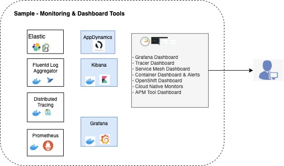

### XIV.	Telemetry

The principle focuses on design to include the collection of monitoring domain/application-specific logs/data, health information, or more statistics on modern cloud platforms. With increasing dynamicity in the deployments especially in Cloud Native environments, it has become essential to address this factor. Monitoring of a typical cloud-native application can include (but not limited to) -
- Application performance monitoring (APM) - stream of events monitoring the application's performance
- Domain-specific telemetry - stream of events and data for analytics and reporting
- Health and system logs - stream of events, such as application start, shutdown, scaling, web request tracing, and the results of periodic health checks

It is important to have the right Telemetry controls in place for the success of the application in the Cloud Native environment. There are a lot of tools already available to facilitate the same. To name a few – Cloud Provider Tools for Health and System Logs, ELK, Jaeger, Grafana, Prometheus, APM tools like AppDynamics, and others from tools used for Container Orchestration.




##### Sample spring - swagger dependencies -
```sh
dependencies {
    // Jaeger dependencies
    implementation group: 'io.opentracing.contrib', name: 'opentracing-spring-jaeger-cloud-starter', version: '3.1.2'
    implementation group: 'io.opentracing.contrib', name: 'opentracing-spring-cloud-starter', version: '0.5.9'

    //Log4j dependency 
    implementation group: 'log4j', name: 'log4j', version: '1.2.17'

    //Health probe dependency - spring-boot example
    implementation ("org.springframework.boot:spring-boot-starter-actuator:${project.spring_boot_version}")
}
```
