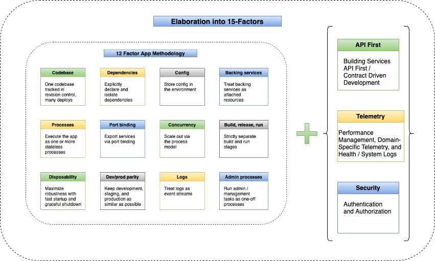

## Fifteen Factor App

In the continuously evolving world of technology, the most pressing requirement for any software development is to have the application performant, scalable, easily manageable, and resilient. In 2012, programmers at Heroku debuted the 12-Factor app methodology. Twelve-Factor app states the General Principles and Guidelines for creating robust Enterprise Applications.  

In the last decade, the rise of software as a service (SaaS) has reshaped the enterprise-software industry and the software disruption is on high and continuously demanding for adopting new strategic principles, Twelve-factor app principles are equally effective and are aligned with new principles being layout out, but at the same time, need to have extensions to these principles has also ascended.

Modern application architectures are more complex and the containerized approach of hosting Cloud Native applications, especially the microservices architecture, makes the complete environment highly dynamic. This article focuses on the additional factors being discussed across the industry, and are being pretty much in force as well. 

#### The Methodology - Fifteen Factor App

Fifteen Factors are an extension and suggested additions to the twelve factors that support the modern application architectures. Looking at the complexity and architectural changes witnessed in modern applications, existing layout principles are being elaborated further and the key suggested factor additions are as below –
- API First Approach
- Telemetry
- Security (Authentication and Authorization)

The methodology remains aligned with the principles suggested in core Twelve-Factor App methodology with an extension to additional factors –
- Use Declarative Formats for setup automation, to minimize time and cost for new developers joining the project
- Have a Clean Contract, offering maximum portability between execution environments
- Are suitable for deployment on modern Cloud Platforms, obviating the need for servers and systems administration
- Minimize Divergence between development and production, enabling continuous deployment for maximum agility
- Dynamically Scalable without significant changes to tooling, architecture, or development practices.
- Service-Driven Approach – Availability of the contract to be consumed by a Front-end client application, routing gateway, or any other downstream system
- Monitoring the distributed applications deployments for domain/application-specific logs/data, health information, or more statistics on modern cloud platforms
- Security (Authentication / Authorization) is addressed appropriately so that identity is implemented for each of the requests
 

#### Article References to 15 Factors

| Reference                                                 | Description                                                  |
| ----------------------------------------------------- | ------------------------------------------------------------ |
| [Initial Setup & Tools](./setup_and_tools.md)                                     | Quick setup and tools reference to start with                          |
| [01 - Codebase](./01_codebase.md)                                     | Start with Git Repository                          |
| [02 - Dependencies](./02_dependencies.md)                                     | Handle Dependencies                          |
| [03 - Config](./03_config.md)                                     | Managing project Configurations                          |
| [04 - Backing services](./04_backing_services.md)                                     | Backing Services Insight                          |
| [05 - Build, Release, Run](./05_build_release_run.md)                                     | Build, Release, Run stages reference                          |
| [06 Processes](./06_processes.md)                                     | Stateless Processes                          |
| [07 - Port binding](./07_port_binding.md)                                     | Port Binding Approach reference                          |
| [08 - Concurrency](./08_concurrency.md)                                     | Bringing-in Concurrency                          |
| [09 - Disposability](./09_disposability.md)                                     | Bringing-in Concurrency                          |
| [10 - Dev / Prod Parity](./10_dev_prod_parity.md)                                     | Bringing-in Concurrency                          |
| [11 - Logs](./11_logs.md)                                     | Logging Guidelines                          |
| [12 - Admin Processes](./12_admin_processes.md)                                     | Manage Admin Processes                          |
| [13 - API First](./13_api_first.md)                                     | API First Approach                          |
| [14 - Telemetry](./14_telemetry.md)                                     | Telemetry - Application Monitoring                          |
| [15 - Security](./15_security.md)                                     | Security - Authentication / Authorization                             
