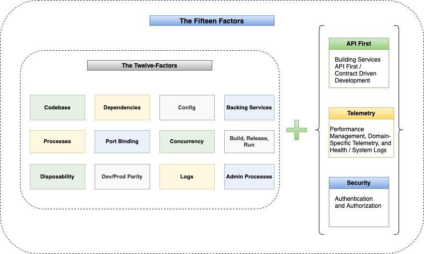

## 15 factor App

In the continuously evolving world of technology, the most pressing requirement for any software development is to have the application performant, scalable, easily manageable, and resilient. In 2012, programmers at Heroku debuted the 12-Factor app methodology.

Twelve-Factor app states the General Principles and Guidelines for creating robust Enterprise Applications.  In the last decade, the rise of software as a service (SaaS) has reshaped the enterprise-software industry and the software disruption is on high and continuously demanding for adopting new strategic principles, Twelve-factor app principles are equally effective and are aligned with new principles being layout out. 

Looking Beyond (Fifteen-Factor App) - Modern application architectures are more complex and the containerized approach of hosting Cloud Native applications, especially the microservices architecture, makes the complete environment highly dynamic. Considering the scenario, existing layout principles are being elaborated further and three additional factors are suggested – API First approach, Telemetry, and Security (Authentication and Authorization) 

#### Article References to 15 Factors

| Topic                                                 | Description                                                  |
| ----------------------------------------------------- | ------------------------------------------------------------ |
| [Intial Setup & tools](./setup_and_tools.md)                                     | Quick setup and tools reference to start with                          |
| [01 Codebase](./01_codebase.md)                                     | Start with Git Repository                          |
| [02 Dependencies](./02_dependencies.md)                                     | Handle Dependencies                          |
| [xxxxx](./02_xxxxx_.md)                                     | Sample Description                             
